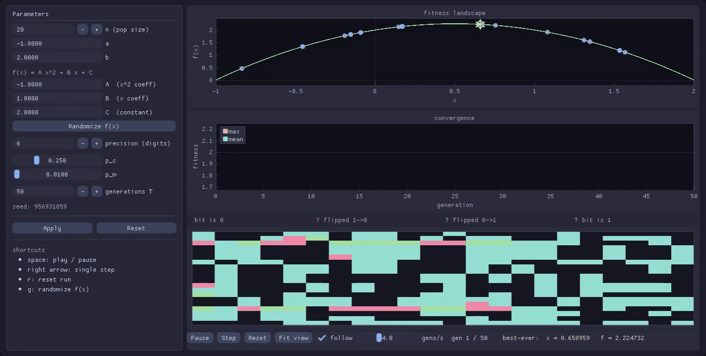

# ga-quadratic

Genetic algorithm in C++ that maximizes `f(x) = Ax² + Bx + C` over a closed interval `[a, b]`.



## Building

**Dependencies (Linux):**

```
sudo apt install build-essential cmake git \
    libgl1-mesa-dev libxinerama-dev libxcursor-dev \
    libxi-dev libxrandr-dev libxxf86vm-dev pkg-config
```

**Headless (no GUI):**

```bash
cmake --preset default   # or: cmake -S . -B build/debug -DCMAKE_BUILD_TYPE=Debug
cmake --build build/debug -j
```

**With GUI** (fetches GLFW + Dear ImGui + ImPlot on first configure, takes ~1-2 min):

```bash
cmake --preset gui       # or: add -DGA_BUILD_GUI=ON
cmake --build build/gui -j
```

## Running

```bash
# interactive — prompts for each parameter on stdin
./build/debug/ga

# from a file
./build/debug/ga --in input.txt --out Evolutie.txt

# reproducible run (fixed seed)
./build/debug/ga --in input.txt --seed 42

# GUI
./build/gui/ga --in input.txt --gui
./build/gui/ga --in input.txt --gui --seed 42
```

## Input file format

Blank lines and `#` comments are ignored. Parameters in order:

```
# population size
20
# domain  a  b
-1 2
# polynomial coefficients  A  B  C   (f(x) = Ax² + Bx + C)
-1 1 2
# precision (decimal digits)
6
# crossover probability
0.25
# mutation probability  (per bit)
0.01
# number of generations
50
```

## Output file

Generation 1 is logged in full: initial population, selection probabilities, cumulative intervals, selection draws, crossover participation and events, post-crossover and post-mutation populations.

Generations 2..T append one line each: `max  mean` fitness.

## Notes

- **Elitism:** the best individual always survives to the next generation unchanged.
